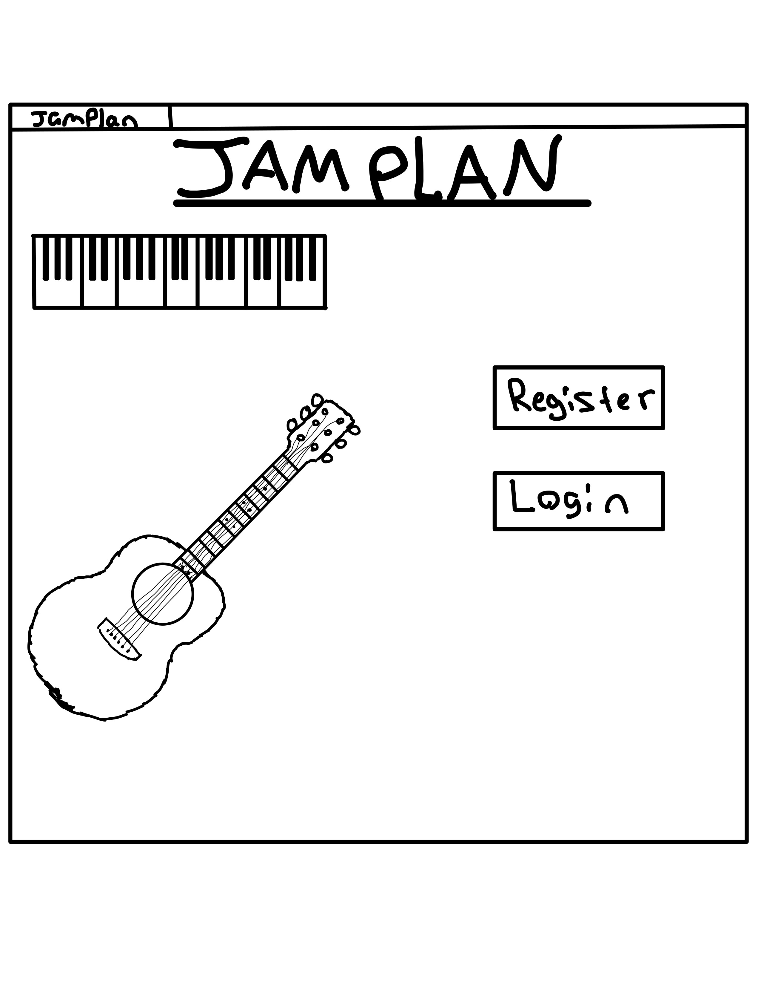
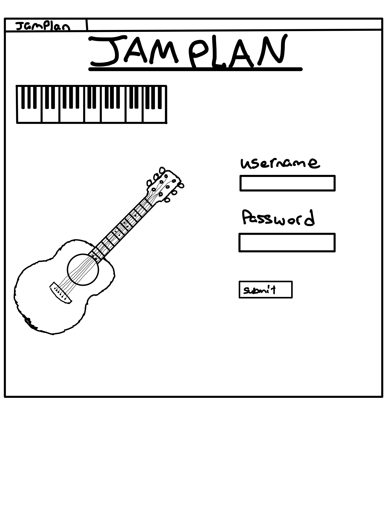
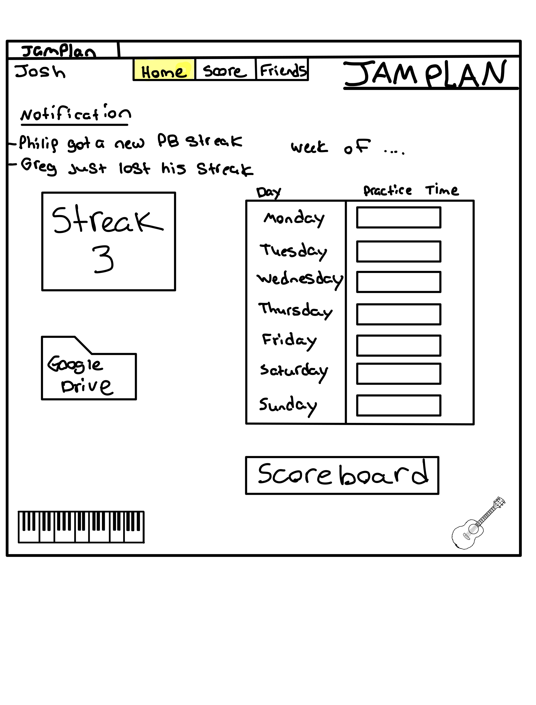
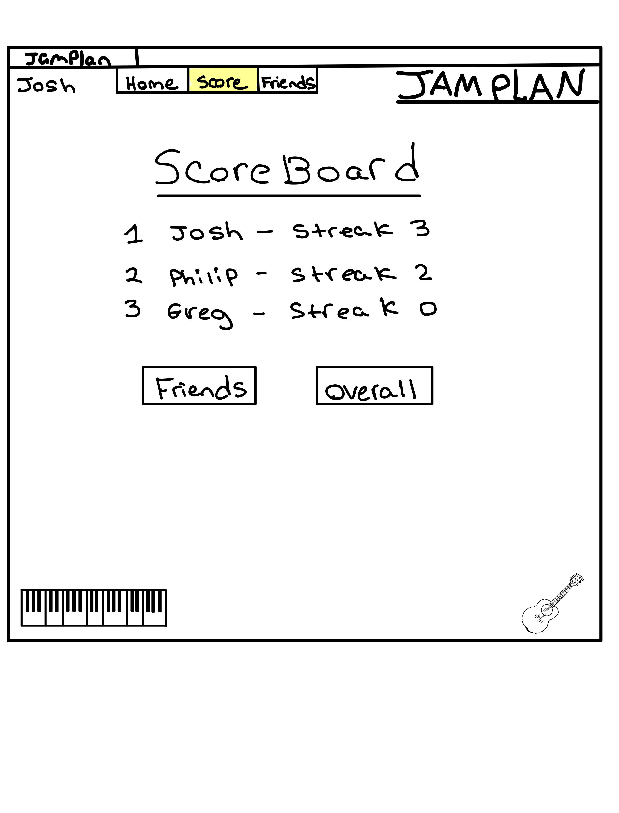
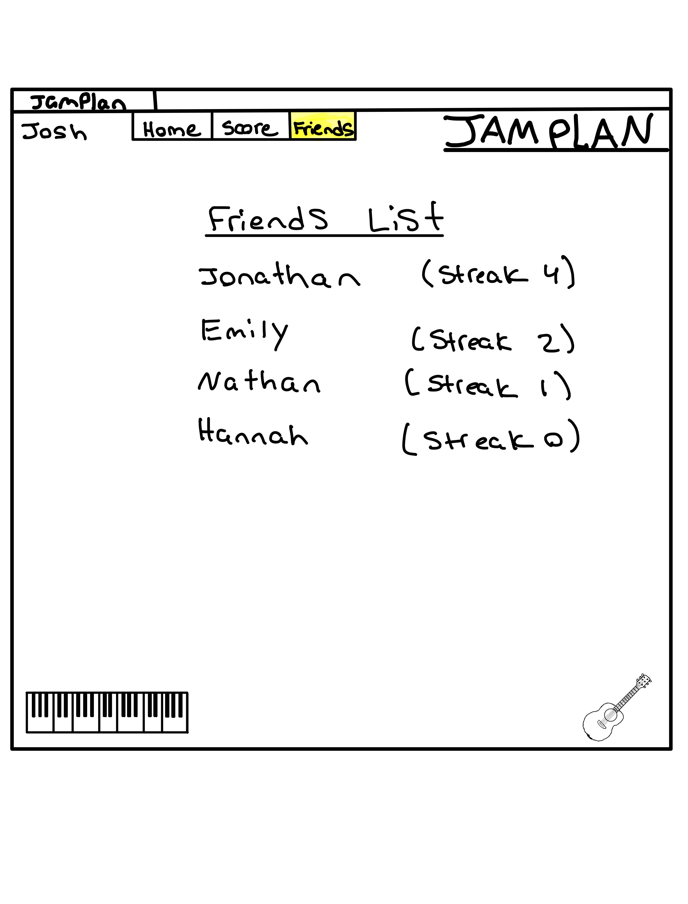

# CS260Startup
CS 260 Web programming project

# Music Practice Scheduler

## Specification Deliverable

### Elevator pitch

Have you ever wanted to learn an instrument, or improve at singing but you lack the structure and motivation to continue? With JamPlan you can set practice goals and compete with others to get the longest practicing streak. JamPlan also offers integration with google drive so you can store your sheet music, warm-ups, fingering charts, and anything else you need to take you musicianship to the next level!

### Design 

This is what it will look like when you first load up the page

This is what it will look like when you login/register a user

This is what it will look like when you register and are on Home tab

This is what it will look like when you are on the scoreboard tab

This is what it will look like when you are on the Friends tab

### Key Features

- Secure login over HTTPS
- Ability to set time goals for practicing 
- Tracks your practice streak and notifies others in your friend group when new high is reached 
- Scoreboard to see who has the longest practice streak (overall and among friends)
- Folder connected to google drive to store music documents

### Technologies 

I am using the required technology in the following ways:

- **HTML** - Uses HTML structure for framework of the Website. Multiple HTML pages for things such as login screen, scoreboard, practice log, and virtual piano(maybe). 
- **CSS** - Application styling that looks good and makes it easy to find things.
- **React** - Provides login, inserting practice times, displaying others scores, and use of React for routing and components 
- **Service** - Backend service with endpoints for:
   - login
   - inserting practice times
   - google drive implementation 
   - retrieving practice streak scores 
- **DB/Login** - Store users, practice times, current practice streak, and top streak in database. Register and login users. Credentials securely stored in database so that people can't add practice times unless authorized by the login
**WebSocket** - Whenever a user gets a new highest practice streak, a message is sent to everyone in their freiend group. People in friend groups can send messages to each other

## HTML Deliverable

For this deliverable I built out the structure of my application using HTML

- **HTML pages** - 6 HTML pages for Index,Login,Register,Home(logpage),FriendsList,Scoreboard,Message
   - Index - Displays the option to login or register a new user
   - Register - Displays the option to register a user providing username,password, and email
   - Home - Displays the practice log page which is very empty and non functional right now
   - FriendsList - Displays your list of friends and the option to message one of them
   - Scoreboard - Displays Either the total scoreboard or friends scoreboard
   - Message - Is just a place holder for the websocket sending messages to friends 
   - Google Drive - Is just a place holder for API call later on
- **Links** - The different buttons/ links take you to different places on the Application
   - Menu - Once logged in you can go to Home,Scoreboard, or FriendsList throught the menu
   - Logout/Exit - this allows you to go back to index from anywhere once not in index
   - Login button goes to login.html, Register button goes to register.html
   - A link to my github is displayed on the index page
- **Placeholder for 3rd party service**
   - Google drive box that pops up an alert that says it doesnt work yet
- **Application images** 
   - Piano and guitar added to home page of application, not formated 
- **DB/Login**
   - Info from login stored in a database and username displayed in top corner
   - Streak number would be pulled from database and displayed as well of the scoreboard information
- **WebSocket**
   - When you click on message next to a friends name, another page pops up as a placeholder for websocket messaging

## CSS Deliverable

- **Header,footer, and main content body** - properly styled elements using CSS
   - Added Header with Black background and fancy font that displays the website name
   - Added Footer with Black background and displays name and github on opposite sides using CSS
- **Navigation Elements** - properly styled elements using CSS
   - The nav element for current page is white but the rest are light blue and they are placed in the top left of the page using CSS
- **Responsive to window resizing** - properly inplemented with CSS
   - When the window is shorter than a certain height, or width, the elements stay or dissapear depending on page. The header and footer also dissapear after a certain height is crossed using media queries
- **Application Elements** - properly styled with CSS
   - Many buttons added throughout using bootstrap
   - Multiple tables styled with bootstrap and modified for my liking
- **Application Text Content** - properly styled with CSS
   - All of the text is changed into a different font imported from google fonts
   - Text size is adjusted for specific needs
- **Application Images** - properly styled with CSS
   - images size was changed and location on the screen was change for visual appeal
   - images disappear when the window resizes
   - cut out bottom right corner of guitar picture to make it look better

## React Deliverable 
- **Bundled with Vite** - deployed and bundled using Vite
- **Components** 
   - login/register - both do the same thing, when a user logs in, they are added to local storage so their name,streak,and times can be accessed through the local storage
   - logpage - component contains the Streak, Googledrive buttons as well as the timesheet. The streak updates with consecutive inserted practiced times. Only the current days time is editable and all reset to 0 at the end of the week but the streak persits in the local storage. 
   - scoreboard - Displays all of the users, their streaks, and the order which they compare to others on the leaderboard
   - userList - Similar to scoreboard component but adds a message button and hides the current person from the list so they cant try and send a message to themselves. The message button that is clicked on saves the person the user is trying to message for further implementation of websockets
   - messagepage - Has a message box and displays the person the user is messaging by retrieving the receiver from localStorage. 
   - googledrivepage - Just a placeholder for the google drive service to be implemented later
- **Router** - Routing between different compenents throughout the application
- **Hooks** - Uses hooks such as useState and useEffect to implement functionality of the application

## Service Deliverable

- **Create an HTTP service using Node.js and Express**
   - Added an index.js file to act as the backend server that saves the variables in memory to prepare to implement a database
- **Frontend served up using Express static middleware**
   - Service uses express middleware to be called by front end
- **Frontend calls third party service endpoints**
   - frontend uses fetch to call third party quote service.
   - I was trying to get it to do google drive stuff but wasnt able to figure it out in time.
   - Changed the google drive connect button into a new quote button that gives a different quote each time you click it. and displays on the home logpage
- **Your backend provides service endpoints**
   - Backend provides endpoints for login,create,logout,getStreaks,updateStreaks
- **Frontend calls your service endpoints**
   - frontend uses fetch to call service endpoints for login,create,logout,getStreaks,updateStreaks

## Login/DB Deliverable 

- **Supports new user Registration**
   - User can register and information is stored in the database for persistance. Does not allow for a blank username or password
- **Supports existing user authentication**
   - User can login and be reauthenticated by being given a new authToken stored in the database
- **Stores application data in MongoDB**
   - Streaks and practice times are updated and stored inside the database
- **Stores and retrieves credentials in MongoDB**
   - Users and their passwords(encrypted) are stored in the database upon registering and retreived upon loging in
- **Restricts application functionality based upon authentication**
   - Logpage(Home),Scoreboard,UsersList and by extention messaging page, are all unavailable until user is either already in the database and authenticated, or added to the database and authenticated 

## Websocket Deliverable
- **Backend listens for WebSocket connection**
   - Backed sets up event listeners to listen for websocket messages from the front end
- **Frontend makes WebSocket connection**
   - Front makes a websocket connection so it can talk with other clients through the backend
- **Data sent over WebSocket connection**
   - messages sent from each client is sent through websocket
- **WebSocket data displayed in the application interface**
   - messages sent by each client show up for them and the person they sent the messages to. Including private messages between users
- **All visible elements are working**
   - The only thing that wasnt working from the last deliverable was the websocket.
