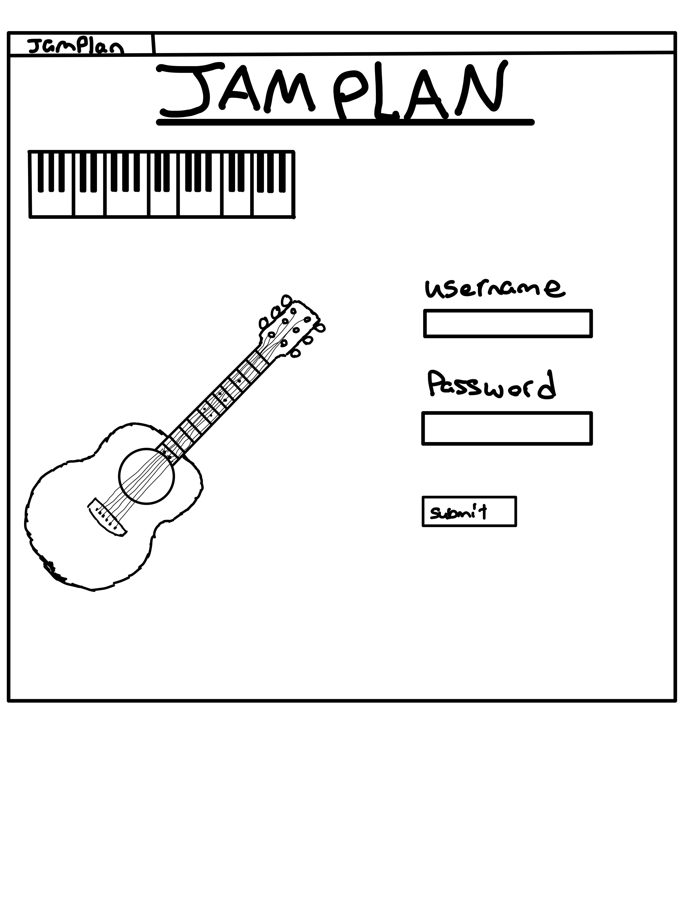
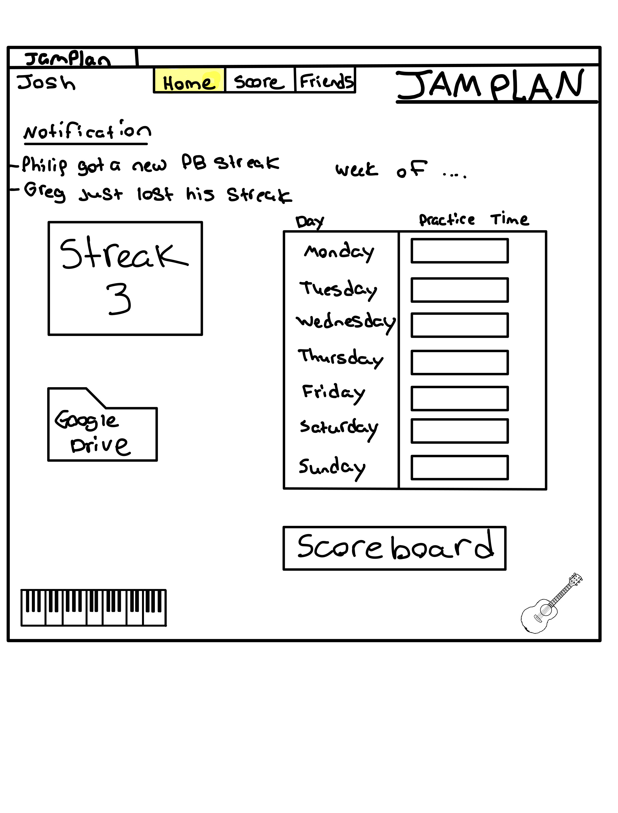
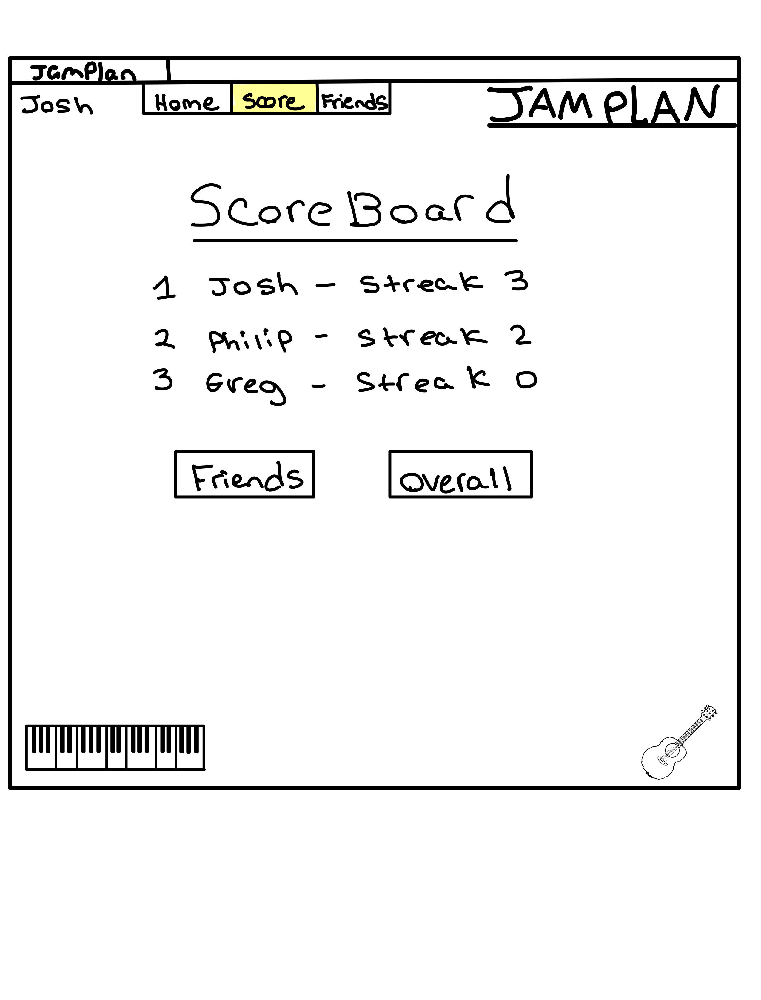
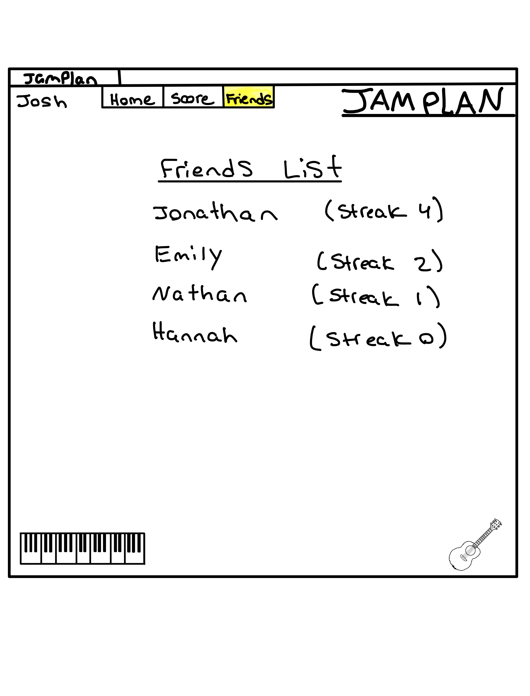

# Music Practice Scheduler

## Specification Deliverable

### Elevator pitch

Have you ever wanted to learn an instrument, or improve at singing but you lack the structure and motivation to continue? With JamPlan you can set practice goals and compete with others to get the longest practicing streak. JamPlan also offers integration with google drive so you can store your sheet music, warm-ups, fingering charts, and anything else you need to take you musicianship to the next level!

### Design 

This is what it will look like when you first load up the page

This is what it will look like when you login/register a user

This is what it will look like when you register and are on Home tab

This is what it will look like when you are on the scoreboard tab

This is what it will look like when you are on the Friends tab

### Key Features

- Secure login over HTTPS
- Ability to set time goals for practicing 
- Tracks your practice streak and notifies others in your friend group when new high is reached 
- Scoreboard to see who has the longest practice streak (overall and among friends)
- Folder connected to google drive to store music documents

### Technologies 

I am using the required technology in the following ways:

- **HTML** - Uses HTML structure for framework of the Website. Multiple HTML pages for things such as login screen, scoreboard, practice log, and virtual piano(maybe). 
- **CSS** - Application styling that looks good and makes it easy to find things.
- **React** - Provides login, inserting practice times, displaying others scores, and use of React for routing and components 
- **Service** - Backend service with endpoints for:
   - login
   - inserting practice times
   - google drive implementation 
   - retrieving practice streak scores 
- **DB/Login** - Store users, practice times, current practice streak, and top streak in database. Register and login users. Credentials securely stored in database so that people can't add practice times unless authorized by the login
**WebSocket** - Whenever a user gets a new highest practice streak, a message is sent to everyone in their freiend group. People in friend groups can send messages to each other

Elastic IP for Server
   - 52.21.62.117
   

